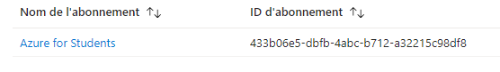
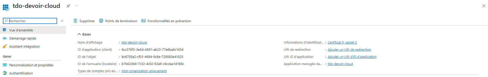
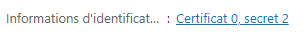
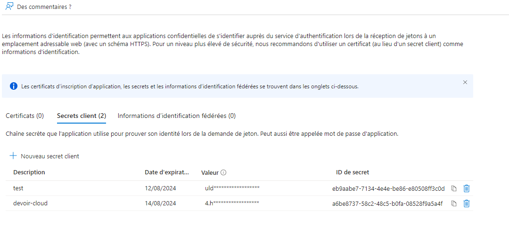
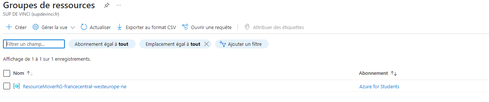
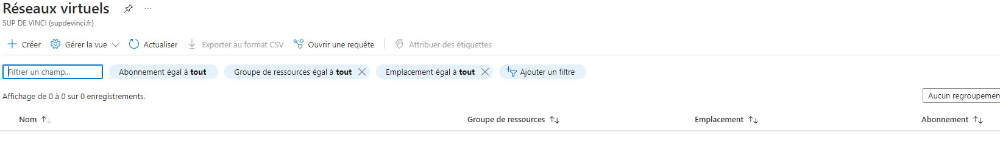
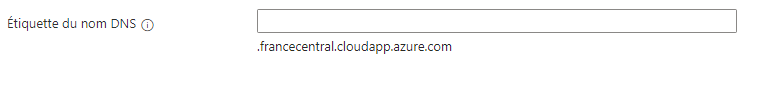

## Pour commencer

First, run the development server:

```bash
npm install
npm run dev
```

Open [http://localhost:3000](http://localhost:3000) with your browser to see the result.

## Remplir le .env

Récuperer le .env.dist et créer un .env à la racine du projet.

Voici les étapes pour remplir chaque donnée du .env

# AZURE_SUBSCRIPTION_ID

Sur votre portail azure aller sur abonnements 

Copier l'id de l'abonnement et coller le sur le .env 

# AZURE_TENANT_ID, AZURE_CLIENT_ID

Sur votre portail azure aller sur inscription d'application : 
créer une application liés à l'abonnement de sup de vinci une fois créer donner lui le role propriétaire

Le tenant_id représente l'id de l'annuaire 
Le client_id représente l'id de l'application 

# AZURE_CLIENT_SECRET

Pour le client secret dans votre application cliquer sur 

Vous etes rediriger :


Créer un nouveau client secret et attention récuperer sa valeur et non pas l'id 

# AZURE_RESSOURCE_GROUP_NAME

Sur votre portail azure aller sur groupes de ressources et créer en un en lien avec l'abonnement adequat
une fois créer récuperer son nom :

Ici dans l'exemple le nom est : ResourceMoverRG-francecentral-westeurope-ne

# AZURE_VIRTUAL_NET_NAME

Sur votre portail azure aller sur réseau virtuel

Créer un réseau virtuel en lien avec l'abonnement et dans votre groupe de ressource
Récuperer son nom

# AZURE_PUBLIC_IP_NAME 

Sur votre portail azure aller sur Adresses IP public : creer une adresse ip public en lien avec l'abonnement et le groupe de ressource
Lors de la création n'oubliez pas de remplir ce champs cela sera votre nom de domaine

Recuperer le nom que vous lui avez donné lors de la création

# AZURE_DOMAIN_LABEL

Recuperer le nom de domaine que vous avez créer en meme temps que l'adresse IP public

Ne prenez pas cette partie : .francecentral.cloudapp.azure.com uniquement ce que vous avez saisie lorsque vous avez rempli le champ

# AZURE_LOCATION

Mettez : francecentral


Une fois tout les champs du .env rempli avec les bonnes informations vous pouvez commencer a tester.